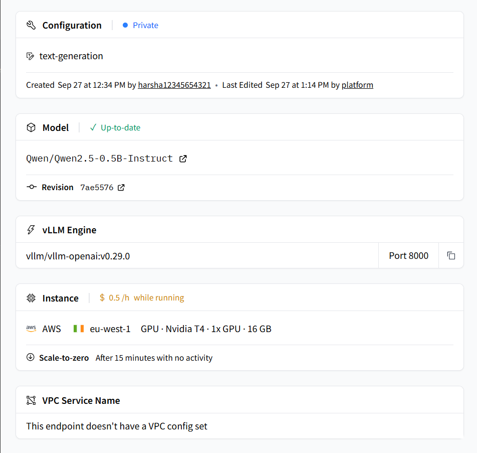
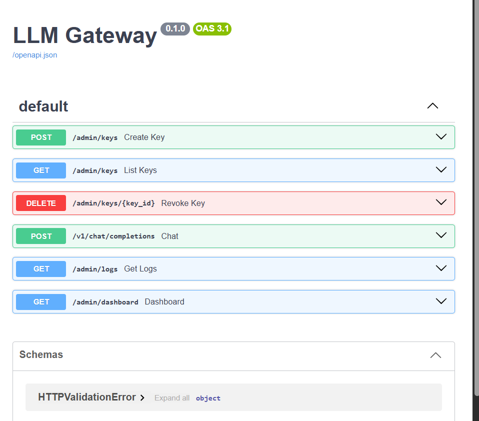
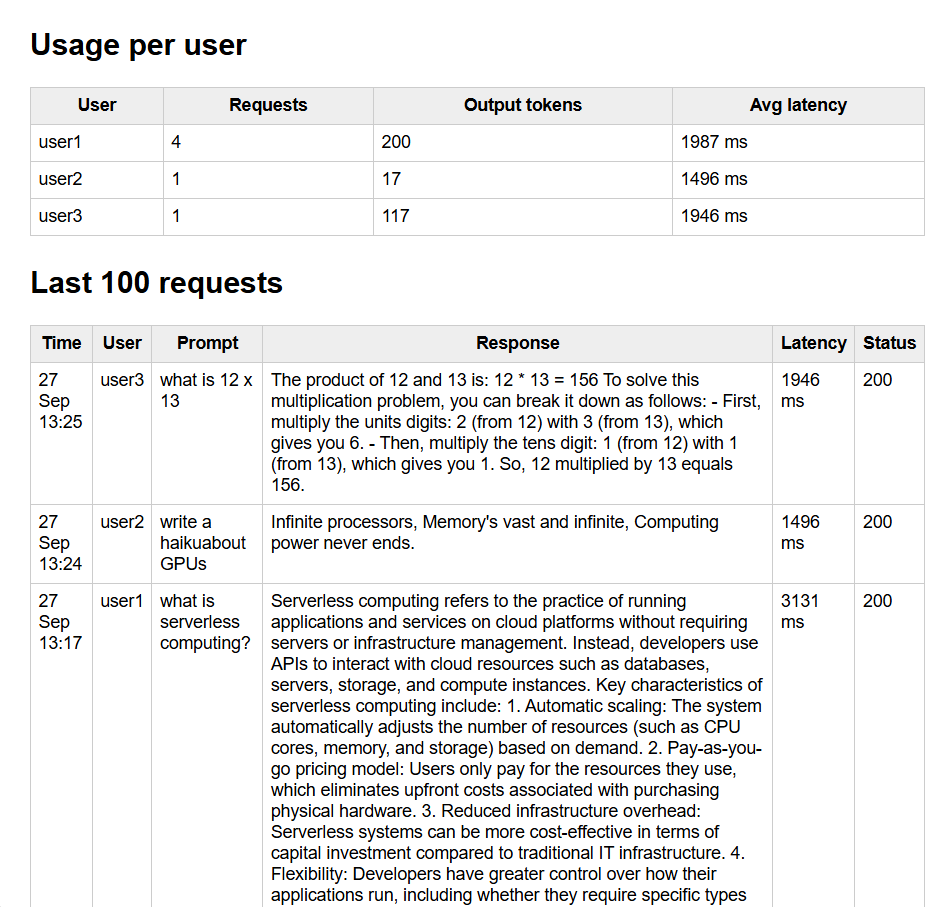
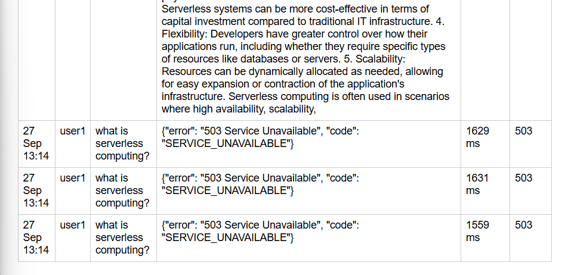

# LLM Inference Gateway

**Deploy an open-source LLM on serverless GPU infrastructure, give every user their own API key, and log every prompt and response.**

This project simulates a real client request:

> *"Here is a model. Deploy it serverless, give access to 5 users with separate keys, and let us see what each user asked and what the model answered."*

| Requirement | How it is solved | Status |
|---|---|---|
| Deploy a model serverless | Hugging Face Inference Endpoint, vLLM engine, **scale-to-zero** | ✅ Done |
| One access key per user (5 users) | Own FastAPI gateway issues `sk-...` keys, stores only SHA-256 hashes | ✅ Done |
| Revoke a single user | `DELETE /admin/keys/{id}`, and other users keep working | ✅ Done |
| See what users asked and what the model answered | Every request logged in SQLite, admin dashboard, and Markdown/CSV reports | ✅ Done |


---

## Architecture

```
  user1 ─┐
  user2 ─┤   own key (sk-...)      ┌─────────────────────────┐   backend token (secret)   ┌────────────────────────────┐
  user3 ─┼────────────────────────▶│      LLM GATEWAY        │───────────────────────────▶│  Hugging Face Endpoint     │
  user4 ─┤                         │  (FastAPI, Python)      │                             │  Qwen2.5-0.5B-Instruct     │
  user5 ─┘◀────────────────────────│ 1. verify key (hash)    │◀───────────────────────────│  vLLM · Nvidia T4          │
               answer              │ 2. forward prompt       │          answer             │  scale-to-zero after 15 min│
                                   │ 3. log prompt + answer  │                             └────────────────────────────┘
                                   └───────────┬─────────────┘
                                               ▼
                                   SQLite (api_keys, logs)
                                   → admin dashboard, JSON API, reports
```

**Why a gateway?** If users were given the Hugging Face token directly, everyone would share one key: there would be no way to tell who asked what, no way to block one person, and no logs. The gateway gives each user an identity that can be **authenticated, revoked and audited**, and the backend token never leaves the server.

---

## Live proof

### 1. Model deployed serverless on Hugging Face
Qwen2.5-0.5B-Instruct on AWS `eu-west-1`, 1× Nvidia T4 (16 GB), **$0.50/h only while running**, private access, **scale-to-zero after 15 minutes idle**.



### 2. Gateway API (auto-generated FastAPI docs)
Admin endpoints manage keys and logs. `/v1/chat/completions` is **OpenAI-compatible**, so the official OpenAI SDK works against it.




### 4. Every request logged per user
The admin dashboard shows usage per user (requests, output tokens, average latency) and each prompt with the model's response.



### 5. Cold start captured in the logs
The first requests after the endpoint had scaled to zero returned **503 Service Unavailable** while the GPU container started. The gateway logged these failures too, and requests succeeded once the model was warm (13:14 → 13:17).



### Results from the test run

| User | Requests | Output tokens | Avg latency | Notes |
|---|---|---|---|---|
| user1 | 4 | 200 | 1987 ms | 3 × 503 during cold start, then 200 OK (3131 ms) |
| user2 | 1 | 17 | 1496 ms | Haiku about GPUs. **Revoked afterwards → 401** |
| user3 | 1 | 117 | 1946 ms | "What is 12 × 13?" → 156 |

| Security test | Result |
|---|---|
| No / malformed `Authorization` header | `401 missing API key` |
| Unknown key (`sk-wrong`) | `401 invalid or revoked API key` |
| Revoked key (user2) | `401 invalid or revoked API key`. user1 unaffected |

📄 Full exported report: [`reports/`](reports/) (Markdown report + CSV of every request)

---

## Project structure

```
llm-inference-gateway/
├── gateway/app.py                 # the gateway: keys, auth, proxy, logging, dashboard
├── scripts/
│   ├── create_keys.py             # creates 5 user keys → keys.txt (git-ignored)
│   ├── test_user.py               # acts as a user, via the official OpenAI SDK
│   ├── admin.py                   # list / revoke keys, view logs (no secrets on screen)
│   
├── docs/screenshots/              # proof images
├── reports/                       # exported usage reports
├── requirements.txt
├── .gitignore                     # .env, keys.txt, *.db, venv/ are never committed
└── README.md
```

---

## Gateway API

| Method | Path | Who | Purpose |
|---|---|---|---|
| `POST` | `/v1/chat/completions` | User (`Bearer sk-...`) | Chat with the model (OpenAI format) |
| `POST` | `/admin/keys` | Admin | Create a key for a user. Returns it once |
| `GET` | `/admin/keys` | Admin | List users and active/revoked status (no keys shown) |
| `DELETE` | `/admin/keys/{id}` | Admin | Revoke one user's key |
| `GET` | `/admin/logs?user=` | Admin | Request logs as JSON |
| `GET` | `/admin/dashboard?token=` | Admin | HTML dashboard: usage per user + last 100 requests |

**Database**
- `api_keys(id, user_name, key_hash, active, created_at)`
- `logs(id, user_name, prompt, response, prompt_tokens, completion_tokens, latency_ms, status, created_at)`

---

## Run it yourself

**1. Deploy the model.** On huggingface.co open `Qwen/Qwen2.5-0.5B-Instruct` → **Deploy → HF Inference Endpoints**, then choose:
- GPU (T4 or L4), **Private**, scale-to-zero 15 min, replicas min 0 / max 1
- Inference Engine **vLLM**
- On a T4, add the server arguments `--dtype float16 --max-model-len 4096`

**2. Install**
```bash
git clone https://github.com/<your-username>/llm-inference-gateway.git
cd llm-inference-gateway
python -m venv venv && source venv/Scripts/activate   # Windows Git Bash
pip install -r requirements.txt
```

**3. Configure `.env`.** This file is never committed.
```
BACKEND_URL=https://<your-endpoint>.endpoints.huggingface.cloud/v1
BACKEND_TOKEN=hf_...
BACKEND_MODEL=Qwen/Qwen2.5-0.5B-Instruct
ADMIN_TOKEN=<generate: python -c "import secrets; print(secrets.token_urlsafe(24))">
```

**4. Run and demo**
```bash
uvicorn gateway.app:app --port 8000 --reload        # window 1

python scripts/create_keys.py                       # window 2
K1=$(awk 'NR==1{print $2}' keys.txt); K2=$(awk 'NR==2{print $2}' keys.txt)
python scripts/test_user.py $K1 "What is serverless computing?"
python scripts/test_user.py $K2 "Write a haiku about GPUs"
python scripts/admin.py keys
python scripts/admin.py revoke 2
python scripts/test_user.py $K2 "am I blocked?"     # → 401
python scripts/admin.py logs
python scripts/export_report.py                     # → reports/
```

---

## Key concepts

- **Inference** is using a trained model to generate output for new input. Training happens once; inference happens on every request.
- **Serverless / scale-to-zero:** the GPU runs only while there is traffic. After 15 idle minutes it shuts down, and cost drops to ₹0.
- **Cold start:** the first request after idle wakes the container and loads the model (several minutes for vLLM). HF returns `503` meanwhile. Seen in proof #5.
- **vLLM:** a high-throughput inference engine (PagedAttention + continuous batching) that exposes an OpenAI-compatible API. The first deployment used the *Default* engine, which only supports raw `{"inputs": ...}` generation, so it was redeployed with vLLM to get `/v1/chat/completions`.
- **Tokens:** models read and write sub-word tokens. Cost and limits are per token, so the gateway logs `prompt_tokens` and `completion_tokens` per user.
- **`finish_reason: "length"`:** the answer hit `max_tokens`, which is why some long answers stop mid-sentence.

## Security

- User keys: `secrets.token_urlsafe`, stored as **SHA-256 hashes**, shown only once.
- The backend HF token has the fine-grained **Inference** scope only, and lives only in `.env` on the server.
- `.env`, `keys.txt` and `gateway.db` are in `.gitignore`.
- The endpoint is **Private**: it cannot be called without the HF token.

## Lessons learned

| Problem | Cause | Fix |
|---|---|---|
| `/v1/chat/completions` → `Not Found` | Default engine has no OpenAI API | Redeployed with **vLLM** (the engine can't be changed after creation) |
| `502` from gateway / `503` from HF | Endpoint scaled to zero (cold start) | Wait for *Running*. Warm it up before demos |
| `.env` changes ignored | `--reload` watches only `.py` files | Restart uvicorn after editing `.env` |
| Answers repeat the question | Raw text-generation, no chat template | Use the chat endpoint, which applies the model's template |


---

*Built by Harsha as a hands-on project on LLM inference, serverless deployment and API access management.*